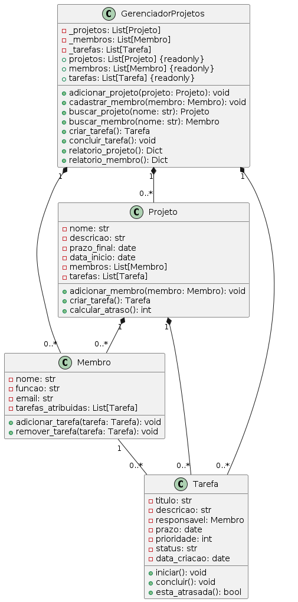

# Sistema de Gerenciamento de Projetos



Um sistema completo para gerenciamento de projetos, times e tarefas, seguindo padrões de arquitetura limpa e boas práticas de desenvolvimento.

## 📦 Estrutura do Projeto

/projeto_gerenciamento
├── /modelos
│ ├── init.py
│ ├── membro.py # Entidade Membro
│ ├── tarefa.py # Entidade Tarefa
│ ├── projeto.py # Entidade Projeto
│ ├── gerenciador.py # Core do sistema
│ └── excecoes.py # Erros personalizados
├── /tests
│ ├── test_membro.py
│ ├── test_tarefa.py
│ ├── test_projeto.py
│ ├── test_gerenciador.py
│ ├── test_excecoes.py
│ └── test_integracao.py
├── diagrama_classes.plantuml # Diagrama UML
├── responsabilidades.md # Docs de design
└── requirements.txt
text


## 🧩 Principais Componentes

### Entidades Principais

1. **`Membro`**
   - Representa um membro da equipe
   - Atributos: nome, função, email, tarefas atribuídas
   - Responsável por gerenciar suas próprias tarefas

2. **`Tarefa`**
   - Unidade básica de trabalho
   - Estados: Pendente, Em Andamento, Concluída
   - Controla prazos, prioridades e responsável

3. **`Projeto`**
   - Agrupamento lógico de tarefas e membros
   - Gerencia cronograma e progresso
   - Calcula métricas de andamento

### Núcleo do Sistema

- **`GerenciadorProjetos`**
  - Singleton que orquestra todas as operações
  - Mantém o estado global do sistema
  - Valida regras de negócio
  - Gera relatórios consolidados

## 🛠️ Como Usar

### Instalação

```bash
git clone https://github.com/seu-usuario/gerenciador-projetos.git
cd gerenciador-projetos
pip install -r requirements.txt

Exemplo Básico
python

from modelos import GerenciadorProjetos, Projeto, Membro

# Inicialização
gerenciador = GerenciadorProjetos()

# Cadastro
projeto = Projeto("Portal Corporativo", "Novo site institucional")
membro = Membro("João Silva", "Desenvolvedor Fullstack")

gerenciador.adicionar_projeto(projeto)
gerenciador.cadastrar_membro(membro)

# Operações
gerenciador.adicionar_membro_projeto("Portal Corporativo", "João Silva")
tarefa = gerenciador.criar_tarefa(
    "Portal Corporativo",
    "Implementar Login",
    "Sistema de autenticação JWT",
    "João Silva",
    prioridade=3
)

# Relatórios
print(gerenciador.relatorio_projeto("Portal Corporativo"))
print(gerenciador.relatorio_membro("João Silva"))

🧪 Testes

Execute toda a suíte de testes:
bash

python -m pytest tests/ -v

Ou testes específicos:
bash

python -m pytest tests/test_gerenciador.py -v

📊 Diagrama de Classes
plantuml

@startuml
!include diagrama_classes.plantuml
@enduml

Gere a imagem com:
bash

plantuml diagrama_classes.plantuml

🚀 Funcionalidades

✔️ Cadastro de projetos, membros e tarefas
✔️ Atribuição de tarefas com validação de responsáveis
✔️ Controle de estados e prazos
✔️ Cálculo automático de atrasos
✔️ Relatórios consolidados
✔️ Sistema de exceções personalizadas
✔️ Testes unitários e de integração
📚 Documentação Adicional

    Design do Sistema

    Diagrama UML

🤝 Contribuição

    Faça o fork do projeto

    Crie sua branch (git checkout -b feature/fooBar)

    Commit suas mudanças (git commit -am 'Add some fooBar')

    Push para a branch (git push origin feature/fooBar)

    Abra um Pull Request

📄 Licença

MIT License - veja LICENSE para detalhes
text


### Recursos Incluídos:

1. **Estrutura Visual Clara** com emojis e seções bem definidas
2. **Diagrama Integrado** (adicione o PNG gerado pelo PlantUML)
3. **Exemplo Prático** de uso da API principal
4. **Instruções de Teste** completas
5. **Links para documentação** adicional
6. **Guia de Contribuição** padrão
7. **Badges** (adicione os do seu CI/CD e cobertura de testes)
